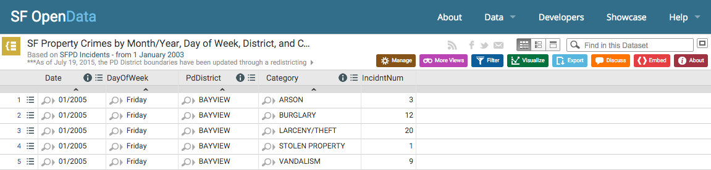
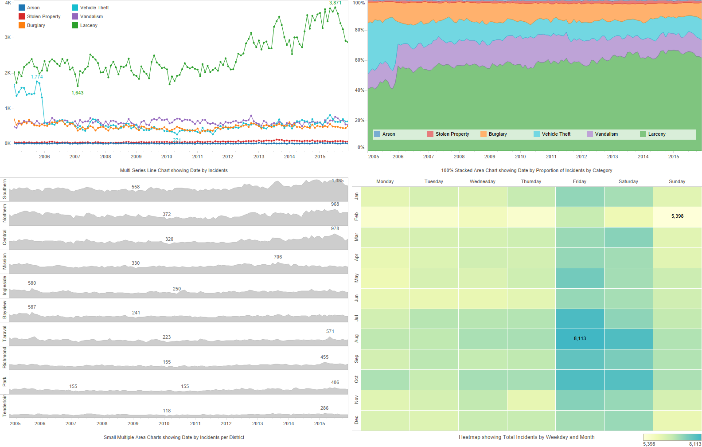

# Homework 2 Time Series

For this homework assignment, you must visualize the [SF Property Crimes 2005 to 2015](sfpd-property-crimes-2005-2015.csv) dataset using various time series visualization techniques. See below for details.

## Eligibility

All of the following requirements must be satisfied for your submission to earn a grade for this homework assignment:

- You must use [D3](https://d3js.org/) to generate your visualizations. You may also use the [ColorBrewer](https://github.com/mbostock/d3/wiki/Ordinal-Scales#colorbrewer) D3 library for this assignment. You may not use any other JavaScript libraries unless explicitly approved by the instructor.

- You must use [`d3.csv()`](https://github.com/mbostock/d3/wiki/CSV) to load the exact CSV provided for this assignment. Any preprocessing of this data must be done in JavaScript, ideally using [`d3.nest()`](https://github.com/mbostock/d3/wiki/Arrays#nest) or [`d3.map()`](https://github.com/mbostock/d3/wiki/Arrays#maps) to process your data.

- You must follow the submission instructions for this assignment, including committing your files on-time to your Github Pages repository and submitting your homework link on-time in Canvas.

- You must have one SVG per visualization submitted. The SVGs for the multi-series line chart and 100% stacked area chart must be 960 by 500 pixels in size. The SVGs for the heatmap and small-multiples area chart may be taller (but not wider) if necessary.

:warning: **Failure to meet the above requirements will at worst make your submission ineligible for grading, and at best result in severe point deductions.**

## Requirements

You may complete any of the following (in any order) for this assignment:

- Heatmap
- Multi-Series Line Chart
- 100% Stacked Area Chart
- Small-Multiples Area Chart

Each base visualization is worth 20 points with 10 points of additional functionality.

:thumbsup: You may earn up to 120% for this homework assignment by completing more visualizations than necessary.

### Heatmap

- [ ] `20 pts` Create a heatmap encoding weekday versus month (or visa versa) along the x- and y-axis, and incident count using a 3-color sequential color palette.

- [ ] `04 pts` Add a compact color legend to your visualization.

- [ ] `02 pts` Add annotations for the x-axis, y-axis, and a chart title or caption. This includes axis lines, tick marks, and tick labels. The exact style is up to you.

- [ ] `02 pts` Add text annotations for the minimum and maximum values only.

- [ ] `02 pts` Add one general conclusion about the data that you can make from your visualization. This can be placed as paragraph text below your SVG.

### Multi-Series Line Chart

- [ ] `20 pts` Create a multi-series line chart encoding one line per type of property crime (e.g. arson, burglary, etc.), the full date range (01/2005 to 12/2015) along the x-axis, and incident count along the y-axis. Each line should have its own color (ideally the same as the area chart).

- [ ] `04 pts` Add a compact color legend to your visualization. Use empty whitespace if possible!

- [ ] `02 pts` Add annotations for the x-axis, y-axis, and a chart title or caption. This includes axis lines, tick marks, and tick labels. The exact style is up to you.

- [ ] `02 pts` Add circle line markers for each data point in the correct color, and text annotations (in the correct color) for the minimum and maximum values for vehicle theft and larceny only.

- [ ] `02 pts` Add one general conclusion about the data that you can make from your visualization. This can be placed as paragraph text below your SVG.

### 100% Stacked Area Chart

- [ ] `20 pts` Create a 100% stacked area chart encoding the full date range (01/2005 to 12/2015) along the x-axis, and the proportion of each category of property crime along the y-axis. Each category should have its own color (ideally the same as the line chart).

- [ ] `04 pts` Add a compact color legend to your visualization. Consider placing the legend on the largest stack to save space (consider how to make sure all colors and text are visible).

- [ ] `02 pts` Automatically reorder the categories (i.e. stacks) by total number of incidents per category. This order may not be hard-coded!

- [ ] `02 pts` Add annotations for the x-axis, y-axis, and a chart title or caption. This includes axis lines, tick marks, and tick labels. The exact style is up to you.

- [ ] `02 pts` Add one general conclusion about the data that you can make from your visualization. This can be placed as paragraph text below your SVG.

## Small-Multiples Area Chart

- [ ] `20 pts` Create a small-multiples area chart encoding the full date range (01/2005 to 12/2015) along the x-axis, total incidents along the y-axis, and one multiple (i.e. one area chart) per police district.

- [ ] `02 pts` Automatically reorder the districts (i.e. multiples) by total number of incidents per district. This order may not be hard-coded!

- [ ] `02 pts` Add text labels for each district. Consider where best to place this text!

- [ ] `02 pts` Add annotations for the x-axis and a chart title or caption. This includes axis lines, tick marks, and tick labels. The exact style is up to you.

- [ ] `02 pts` Add text annotations for the minimum and maximum values for each district.

- [ ] `02 pts` Add one general conclusion about the data that you can make from your visualization. This can be placed as paragraph text below your SVG.

## Data Source



You must use the [`sfpd-property-crimes-2005-2015.csv`](sfpd-property-crimes-2005-2015.csv) CSV file for this assignment. You must use [`d3.csv()`](https://github.com/mbostock/d3/wiki/CSV) to load this file for your visualizations. You should perform any preprocessing necessary of this file in JavaScript, ideally using [`d3.nest()`](https://github.com/mbostock/d3/wiki/Arrays#nest) or [`d3.map()`](https://github.com/mbostock/d3/wiki/Arrays#maps) to process your data.

This file is based on the [SF Property Crimes by Month/Year, Day of Week, District, and Category](https://data.sfgov.org/Public-Safety/SF-Property-Crimes-by-Month-Year-Day-of-Week-Distr/yscu-r9qw) dataset was derived from the [SFPD Incidents - from 1 January 2003](https://data.sfgov.org/Public-Safety/SFPD-Incidents-from-1-January-2003/tmnf-yvry) available on [SF OpenData](https://data.sfgov.org). The data is provided with a [ODC Public Domain Dedication and License (PDDL)](http://opendatacommons.org/licenses/pddl/1.0/). For ease of use, the column headers were renamed and all text values were changed to title case in the final CSV file.

## Submission

Create one SVG per visualization. You can decide whether to place multiple SVGs on the same webpage, or create a landing page that links to separate webpages for each visualization.

Place your homework submission in a subdirectory of your submission repository named `homework2` without spaces in all lowercase. Your entire homework submission should be accessible via the link:

```
http://usf-cs360-2016.github.io/templates-cs360/homework2/
```

Replace `templates` with your MyUSF username, double-check the link works, and then submit it in Canvas by the deadline.

:warning: **You must submit your link on-time to participate in peer feedback. Please submit your link early to avoid any issues!**

## Examples

See this [Tableau Public Workbook](https://public.tableau.com/views/Homework2_22/Homework2Examples?:embed=y&:display_count=yes&:showTabs=y&:toolbar=no) for example visualizations of this dataset. You do not need to recreate these *exactly* for this assignment.



There is not an example for the horizon chart option. If you are uncertain what to do for this option, please post on Piazza.

## References

The following blocks may be useful for this assignment:

- [Small Multiples](http://bl.ocks.org/mbostock/1157787)
- [Multi-Series Line Chart](http://bl.ocks.org/mbostock/3884955)
- [Heatmap](https://bl.ocks.org/sjengle/24aa9dc777bfc295a9e7)
- [100% Stacked Area Chart](https://bl.ocks.org/mbostock/3885211)
- [Stacked Area Chart](https://bl.ocks.org/mbostock/3020685)

You may use existing examples as inspiration, but the final product must be your own. Remember to cite all your sources and inspirations in your code and README to avoid any issues with academic honesty.
