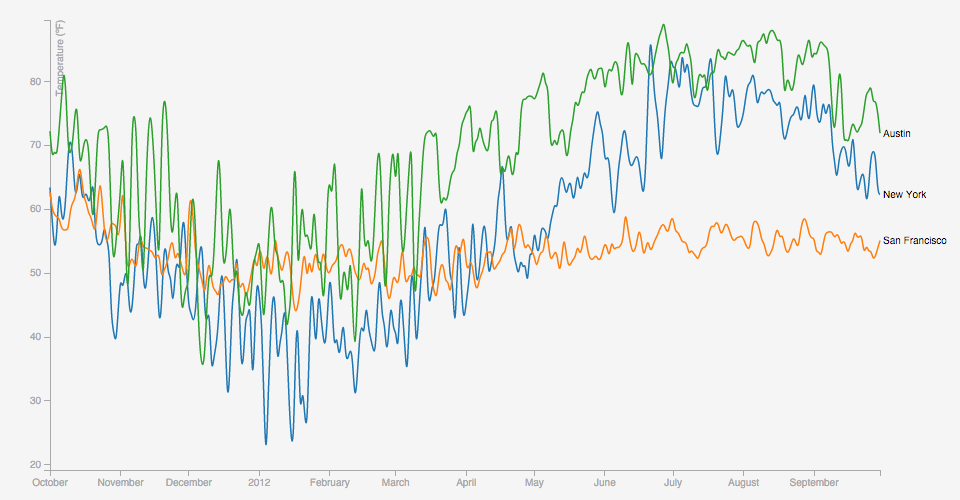

# Lab: Multi-Series Line Chart

This in-class lab will help test whether you understand the [Multi-Series Line Chart](http://bl.ocks.org/mbostock/3884955) example and introduce you to [blockbuilder.org](http://blockbuilder.org/).

## Grade Breakdown

This lab is worth 10 points total. The grade breakdown is as follows:

| Points | Details | Due |
|:------:|:--------|:---:|
| 05/05 | Link Submission | 11:59pm 02/12     |
| 05/05 | Core Functionality | 11:59pm 02/12  |
| 05/00 | Extra Functionality | 11:59pm 02/19 |
| **15/10** | **Total Points Possible** | --- |

You must complete the core functionality by the end of class. You may earn extra credit by completing the extra functionality within a week.

:warning: You may not earn credit for this exercise if you do not submit your link in Canvas by the end of class.

## Link Submission

You need to create a fork (i.e. copy) of the [Multi-Series Line Chart](http://bl.ocks.org/mbostock/3884955) block in [blockbuilder.org](http://blockbuilder.org/) and submit a link to your block in Canvas.

1. Login to your [Github](https://github.com/) account.

2. Open the [Multi-Series Line Chart](http://blockbuilder.org/mbostock/3884955) example in [blockbuilder.org](http://blockbuilder.org/).

3. Click the "**Fork**" button at the top. This will create your own copy of the block as a public [gist](https://gist.github.com/) on Github automatically.

4. Copy the link to this page. Open Canvas in a *new* browser window and submit the copied link for your [Lab 02/12](https://usfca.instructure.com/courses/1558949/assignments/6572139) assignment.

5. (Optional) Open [gist.github.com/](https://gist.github.com/) in a new browser window. Click "See all of your gists", and find the block you just created. Click the "Edit" button and then "Make secret" to hide this block from the general public.

This block will be used for grading. Please make sure all of your edits are to this specific block!

## Core Functionality

For the core functionality, you only need to modify the CSS for your block. Specifically, complete the following:

- Currently the x-axis line along the bottom is not visible. Modify the CSS so that the line is visible.

- Add a light grey background color to the SVG. I suggest [`whitesmoke`](https://developer.mozilla.org/en-US/docs/Web/CSS/color_value) or `#f5f5f5` in hexadecimal.

- Change the color of the axis paths and tick lines to dark grey. I suggest [`darkgrey`](https://developer.mozilla.org/en-US/docs/Web/CSS/color_value) or `#a9a9a9` in hexadecimal.

- Change the color of the axis and tick labels to the same dark grey color as before. You should use the `fill` attribute (not the `stroke` attribute) for text color.

You might find the [CSS](https://developer.mozilla.org/en-US/docs/Web/CSS) and [SVG](https://developer.mozilla.org/en-US/docs/Web/SVG) references useful here. Here is an example of what your SVG should look like:

## Extra Functionality

After you complete the core functionality, you can complete the following for extra credit (up to 5 points extra credit):

- `01pts` Change the y-axis title from "Temperature (°F)" to just "Temp (°F)" and change the formatting of the y-axis tick marks to include the degree ° symbol. Check out the [`axis.tickFormat(...)`](https://github.com/mbostock/d3/wiki/SVG-Axes#tickFormat) documentation for help.

- `01pts` Modify the color of the series text (e.g. "San Francisco") to match the color of the lines. Use the `color` scale already defined for this.

- `01pts` Modify the line generator to use [`linear`](https://github.com/mbostock/d3/wiki/SVG-Shapes#line_interpolate) interpolation between points.

- `01pts` Increase the y-axis domain by 5 degrees (e.g. subtract 5 from the min and add 5 to the max values). *Optional:* Try to do this without modifying the original `y.domain(...)` code. You can do this by calling `y.domain()` a second time to shift the domain by 5.

- `02pts` Add a [circle](https://github.com/mbostock/d3/wiki/SVG-Shapes#svg_circle) for each individual data point in the same color as the associated series. I suggest you create a `g` element to hold all of the points *per series* (e.g. one `g` for San Franciscio, one for New York, and one for Austin).

- `02pts` Shift y-axis from the left-hand side to the right-hand side. You will need to swap the orientation of the tick marks, tick labels, and the axis title.

- `03pts` Shift the line series [text](https://github.com/mbostock/d3/wiki/SVG-Shapes#svg_text) labels from the right-hand side to the left-hand side instead, and adjust the margins accordingly. You may need to tweak how you shift the label for "San Francisco" so it does not overlap with "New York".

- `03pts` Add text annotations to the min and max temperature values in the dataset. *Optional:* Try doing this without hardcoding the values. You do not need to worry about efficiency for this small of a dataset.

You do not need to create new scales for the extra functionality. Most of these require you to modify variables already present, or add new SVG elements using the existing data.

Here is an example of what your SVG should look like if you complete all of the extra functionality:

